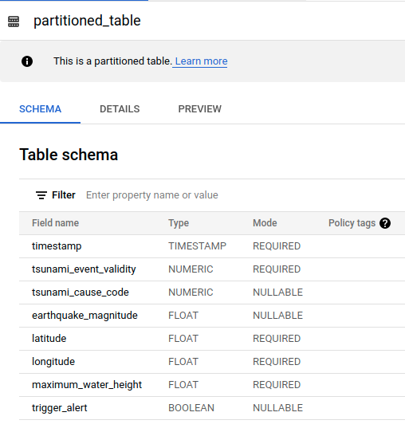
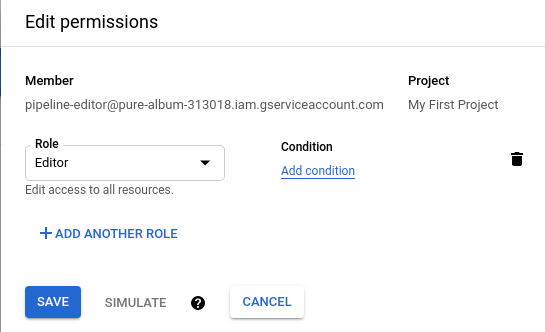
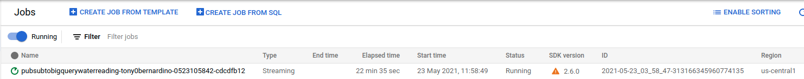
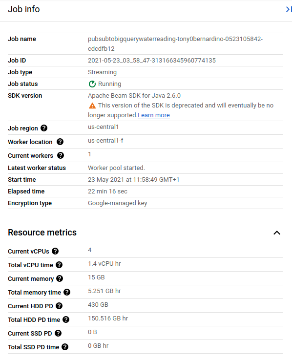
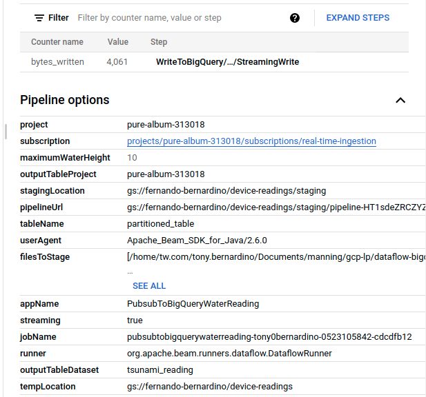
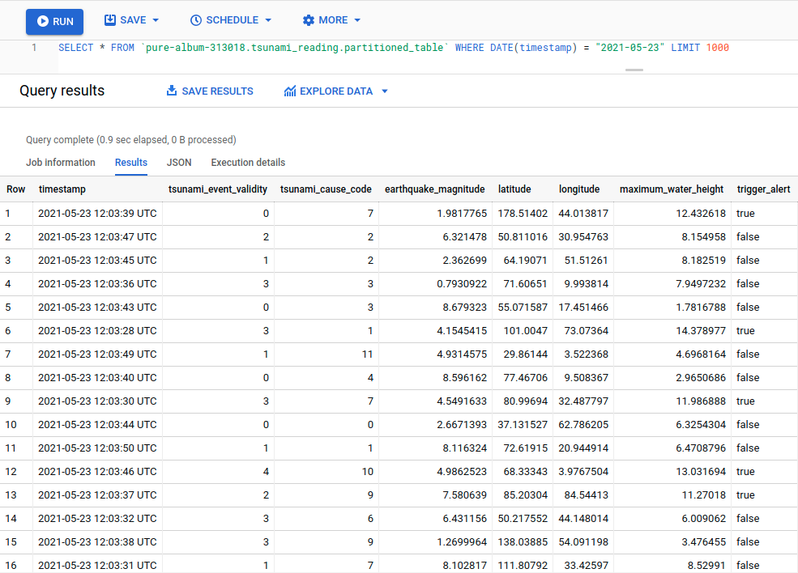

# Milestone 1 - Create a Dataflow Job Detecting Predefined Threshold from Incoming Data

Changed the table `partitioned_table` from last project, to have an additional boolean column called `trigger_alert`: 



Developed the pipeline using Github project 
[dataflow-bigquery-dynamic-destinations](http://github.com/ryanmcdowell/dataflow-bigquery-dynamic-destinations) and
you can final code in 
(PubsubToBigQueryWaterReading)[../src/main/java/com/google/cloud/pso/pipeline/PubsubToBigQueryWaterReading.java],
where the data is processed and row `trigger_alert` value is set based on waterHeight passed in parameter `waterHeight`.

To be able to upload the pipeline and execute it at GCP, had to add a new user `pipeline-editor`, with role `Editor`,
in order to write into project buckets. Doing `gcloud auth application-default login` was picking up the credential from 
my user. 



Added a new key for that user and download it as JSON. Used that key to set `GOOGLE_APPLICATION_CREDENTIALS`:

```sh
  export GOOGLE_APPLICATION_CREDENTIALS=./pure-album-313018-c38ada9fc3cf.json
```

Then built and uploaded the pipeline to GCP:

```sh
  mvn compile exec:java \
     -Dexec.mainClass=com.google.cloud.pso.pipeline.PubsubToBigQueryWaterReading \
     -Dexec.cleanupDaemonThreads=false \
     -Dexec.args=" \
      --project=pure-album-313018 \
      --stagingLocation=gs://fernando-bernardino/device-readings/staging \
      --tempLocation=gs://fernando-bernardino/device-readings \
      --runner=DataflowRunner \
      --subscription=projects/pure-album-313018/subscriptions/real-time-ingestion \
      --waterHeight=10.0 \
      --tableName=partitioned_table \
      --outputTableProject=pure-album-313018 \
      --outputTableDataset=tsunami_reading"
```
This was the result:







Fired up again the synthetic data generator to deliver some messages and waited for them to picked up by the pipeline
and saved to `partitioned_table`:

