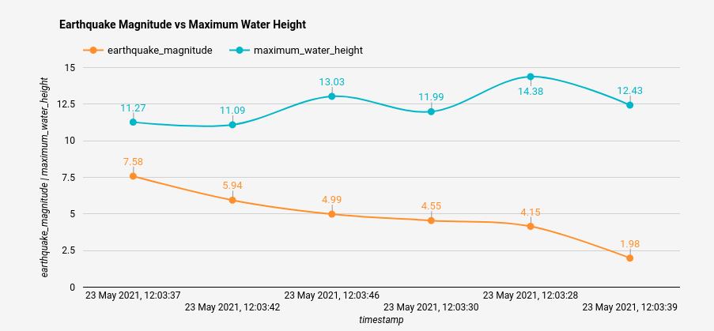
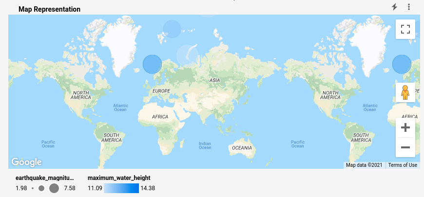
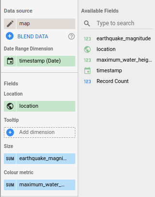

# Milestone 4 - Leverage Google Data Studio to Create Visualization of Data in Cloud BigQuery

## Graph

Graph showing the earthquake magnitude and water height. All alerts where triggered on the same day.



The CUSTOM_QUERY used was:
```sql
    select earthquake_magnitude, maximum_water_height, timestamp 
    from `pure-album-313018.tsunami_reading.partitioned_table` 
    WHERE trigger_alert = true
```
## Map representation

Map representation of reading with trigger_alert = true (I used water height >= 10 meters on other milestones):




The CUSTOM_QUERY used was:
```sql
    select earthquake_magnitude, maximum_water_height, timestamp, concat(latitude,",", longitude) as location 
    from `pure-album-313018.tsunami_reading.partitioned_table` WHERE trigger_alert = true
```

Using the following configuration for the graph

